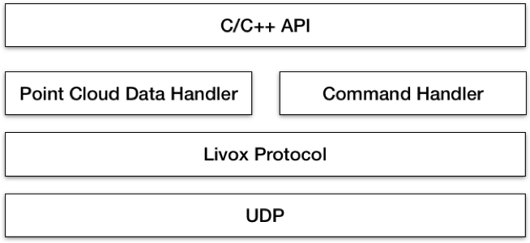

# Introduction

Livox SDK is the software development kit designed for all Livox products. It is developed based on C/C++ following Livox SDK Communication Protocol, and provides easy-to-use C style API. With Livox SDK, users can quickly connect to Livox products and receive point cloud data. 

Livox SDK consists of Livox SDK communication protocol, Livox SDK core, Livox SDK API, Linux sample, and ROS demo. 

# Livox SDK Communication Protocol

Livox SDK communication protocol opens to all users. It is the communication protocol between user programs and Livox products. The protocol consists of control commands and data format. Please refer to the [Livox SDK Communication Protocol](doc/Livox_SDK_Communication_Protocol_EN_20190117.pdf) for detailed information.

# Livox SDK Core

Livox SDK provides the implementation of control commands and point cloud data transmission, as well as the C/C++ API. The basic structure of Livox SDK core is shown as below:



User Datagram Protocol (UDP) is used for communication between Livox SDK and LiDAR sensors. Please refer to the Livox SDK Communication Protocol for further information. Point cloud data handler supports point cloud data transmission, while command handler receives and sends control commands. And the C/C++ API is based on command handler and point cloud data handler.

The Livox LiDAR sensors can be connected to host directly or through the Livox Hub. Livox SDK supports both connection methods. When LiDAR units are connected to host directly, the host will establish communication with each LiDAR unit individually. And if the LiDAR units connect to host through Hub, then the host only communicates with the Livox Hub while the Hub communicates with each LiDAR unit.

# Livox SDK API

Livox SDK API provides a set of C style functions which can be conveniently integrated in C/C++ programs. Please refer to the [Livox SDK API Reference](doc/Livox_LiDAR_SDK_API_Reference.pdf) for detailed information.

## Build Notes

### Dependencies

LivoxTech SDK requires cmake 3.0.0+, Apache Portable Runtime (APR) 1.61+ and Boost 1.54+.

Here we use the Ubuntu 16.04 LTS system and Windows 7,10 as an example to show you how to compile LivoxTech sdk's dependency libraries using apt or direct compiling the source code of apr and boost lib.

##### Ubuntu 16.04 LTS

The following package are required (feel free to cut and paste the apt-get command below):

```
sudo apt install cmake
```

###### Use Apt Install

The following commands can be used to download and install it:

```
sudo apt install \
	 libapr1-dev \
	 libboost-atomic-dev \
	 libboost-system-dev
```

###### Compile the Source Code

You can download the apr source code from http://apr.apache.org/download.cgi and boost source code from http://sourceforge.net/projects/boost/files/boost/1.54.0/. The following commands can be used to compile and install it.

```
tar zxf apr-1.6.5.tar.gz && \
cd apr-1.6.5 && \
./configure --prefix=/usr && \
make && \
sudo make install
```

```
tar zxf boost_1_54_0.tar.gz && \
cd boost_1_54_0 && \
./bootstrap.sh --with-libraries=atomic,system && \
./b2 install --prefix=/usr
```

###### Compile the Project

In the LivoxTech SDK directory (e.g. the checkout root or the archive unpack root), run the following commands to compile the project:

```
mkdir build && cd build && \
cmake .. && \
make
```

###### Run the Project

Run the following commands to run the hub or lidar sample:

```
cd sample\hub && \
./hub_sample
```

```
cd sample\lidar && \
./lidar_sample
```

##### Windows
We test Livox SDK with Visual Studio 2015/2017 on Windows 7/10.

###### Build with Vcpkg

We recommend using [Vcpkg](https://github.com/Microsoft/vcpkg) to build our project. You need to install the following libraries first.

```
.\vcpkg install apr && \
.\vcpkg install boost-atomic && \
.\vcpkg install boost-system && \
.\vcpkg install boost-thread && \
.\vcpkg integrate install
```

In the LivoxTech SDK directory, run the following commands to create the Visual Studio solution file. Please replace vcpkgroot with your vcpkg installation location.

```
mkdir build && \
cd build && \
cmake .. "-DCMAKE_TOOLCHAIN_FILE=[vcpkgroot]\scripts\buildsystems\vcpkg.cmake"
```

Then you can open the livox_sdk.sln project in Visual Studio.

###### Run the Project

In the LivoxTech SDK directory, run the following commands to run the Hub or LiDAR sample:

```
cd build\sample\hub\Debug && \
./hub_sample.exe
```

```
cd build\sample\lidar\Debug && \
./lidar_sample.exe
```

# Livox SDK Linux Sample

Two samples are provided in Sample/Lidar and Sample/Hub, which demonstrate how to configure Livox LiDAR units and receive the point cloud data when directly connecting Livox-SDK to LiDAR units or by using a Livox Hub, respectively. The sequence diagram is shown as below: 


**NOTE**: Please replace the broadcast code lists in the `main.c` for both LiDAR sample and Hub sample with the broadcast code of your devices before running. You can find the following code section in `main.c`:
```
#define BROADCAST_CODE_LIST_SIZE 3
char *broadcast_code_list[BROADCAST_CODE_LIST_SIZE] = {
    "00000000000002",
    "00000000000003",
    "00000000000004"
};
```
