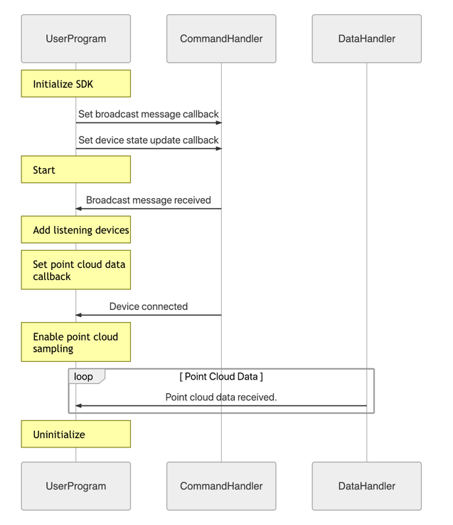

# 1 Introduction

Livox SDK is the software development kit designed for all Livox products. It is developed based on C/C++ following Livox SDK Communication Protocol, and provides easy-to-use C style API. With Livox SDK, users can quickly connect to Livox products and receive point cloud data. 

Livox SDK consists of Livox SDK communication protocol, Livox SDK core, Livox SDK API, Linux sample, and ROS demo. 

## Prerequisites
* Ubuntu 14.04/Ubuntu 16.04, both x86 and ARM (Nvidia TX2)
* Windows 7/10, Visual Studio 2015/2017

# 2 Livox SDK Communication Protocol

Livox SDK communication protocol opens to all users. It is the communication protocol between user programs and Livox products. The protocol consists of control commands and data format. Please refer to the [Livox SDK Communication Protocol](doc/Livox_SDK_Communication_Protocol_EN_20190117.pdf) for detailed information.

# 3 Livox SDK Core

Livox SDK provides the implementation of control commands and point cloud data transmission, as well as the C/C++ API. The basic structure of Livox SDK core is shown as below:


User Datagram Protocol (UDP) is used for communication between Livox SDK and LiDAR sensors. Please refer to the Livox SDK Communication Protocol for further information. Point cloud data handler supports point cloud data transmission, while command handler receives and sends control commands. And the C/C++ API is based on command handler and point cloud data handler.

The Livox LiDAR sensors can be connected to host directly or through the Livox Hub. Livox SDK supports both connection methods. When LiDAR units are connected to host directly, the host will establish communication with each LiDAR unit individually. And if the LiDAR units connect to host through Hub, then the host only communicates with the Livox Hub while the Hub communicates with each LiDAR unit.

# 4 Livox SDK API

Livox SDK API provides a set of C style functions which can be conveniently integrated in C/C++ programs. Please refer to the [Livox SDK API Reference](doc/Livox_LiDAR_SDK_API_Reference.pdf) for further information.

## 4.1 Installation
The installation procedures in Ubuntu 16.04/14.04 LTS and Windows 7/10 are shown here as examples.
### 4.1.1 Ubuntu 16.04/14.04 LTS
#### Dependencies
Livox SDK requires [CMake 3.0.0+](https://cmake.org/), [Apache Portable Runtime (APR) 1.61+](http://apr.apache.org/) and [Boost 1.54+](https://www.boost.org/) as dependencies. You can install these packages using apt:
```
sudo apt install cmake libapr1-dev libboost-atomic-dev libboost-system-dev
```
#### Compile Livox SDK
In the Livox SDK directory, run the following commands to compile the project:
```
git clone https://github.com/Livox-SDK/Livox-SDK.git
cd Livox-SDK/build
cmake ..
make
sudo make install
```
### 4.1.2 Windows 7/10
#### Dependencies
Livox SDK supports Visual Studio 2015/2017 and requires [CMake 3.0.0+](https://cmake.org/), [Apache Portable Runtime (APR) 1.61+](http://apr.apache.org/) and [Boost 1.54+](https://www.boost.org/) as dependencies. [vcpkg](https://github.com/Microsoft/vcpkg) is recommended for building the dependency libraries as follows:
```
.\vcpkg install apr
.\vcpkg install boost-atomic
.\vcpkg install boost-system
.\vcpkg install boost-thread
.\vcpkg integrate install
```
Then, in the Livox SDK directory, run the following commands to create the Visual Studio solution file. Please replace [vcpkgroot] with your vcpkg installation path.
```
cd build && \
cmake .. "-DCMAKE_TOOLCHAIN_FILE=[vcpkgroot]\scripts\buildsystems\vcpkg.cmake"
```
#### Compile Livox SDK
You can now compile the Livox SDK in Visual Studio.
## 4.2 Run Livox SDK Sample
Two samples are provided in Sample/Lidar and Sample/Hub, which demonstrate how to configure Livox LiDAR units and receive the point cloud data when directly connecting Livox SDK to LiDAR units or by using a Livox Hub, respectively. The sequence diagram is shown as below: 



**NOTE**: Please replace the broadcast code lists in the `main.c` for both LiDAR sample ({Livox-SDK}/sample/lidar/main.c) and Hub sample ({Livox-SDK}/sample/hub/main.c) with the broadcast code of your devices before building. The corresponding code section in `main.c` is as follows:
```
#define BROADCAST_CODE_LIST_SIZE 3
char *broadcast_code_list[BROADCAST_CODE_LIST_SIZE] = {
    "00000000000002",
    "00000000000003",
    "00000000000004"
};
```
The broadcast code consists of its serial number and an additional number (1,2, or 3). The serial number can be found on the body of the LiDAR unit (below the QR code). The detailed format is shown as below:


Again, steps for running the samples in Ubuntu 16.04 LTS and Windows 7/10 are shown here as examples.
### 4.2.1 Ubuntu 16.04 /14.04 LTS
For Ubuntun 16.04/14.04 LTS, run the *lidar_sample* if connect with the LiDAR unit(s):
```
cd sample/lidar && ./lidar_sample
```
or run the *hub_sample* if connect with the hub unit(s):
```
cd sample/hub && ./hub_sample
```
### 4.2.2 Windows 7/10
After compiling the Livox SDK as shown in section 4.1.2, you can find `hub_sample.exe` or `lidar_sample.exe` in the {Livox-SDK}\build\sample\hub\Debug or {Livox-SDK}\build\sample\lidar\Debug folder, respectively, which can be run directly. 

# 5 Support
You can get support from Livox with the following methods:
* Send email to dev@livoxtech.com with a clear description of your problem and your setup
* Github Issues
